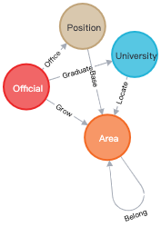
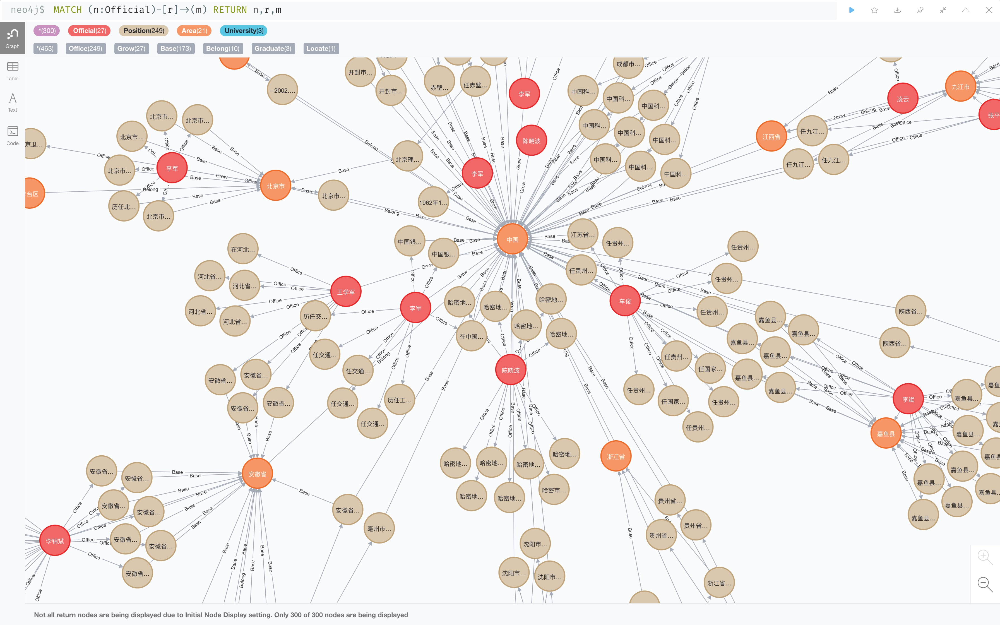

# 中国官员知识图谱

## 代码仓库

https://github.com/XiaoYao-0/OfficialKnowledgeGraph

## 知识图谱设计



### 实体设计

```go
package item

// 院校
type University struct {
   ID   int64  `json:"id"`
   Name string `json:"name"`
}

// 地域
// Level 0: 国家, 1: 省级, 2: 市级, 3: 县级
type Area struct {
   ID    int64  `json:"id"`
   Name  string `json:"name"`
   Level int    `json:"level"`
}

// 官员 0:男 1:女 2:未知
type Official struct {
   ID          int64  `json:"id"`
   Name        string `json:"name"`
   Gender      int    `json:"gender"`
   BirthYear   int    `json:"birth_year"`
   Nationality string `json:"nationality"`
}

// 职位
// Level 0: 国家级正职, 1: 国家级副职, 2: 省部级正职, 3: 省部级副职, 4: 厅局级正职, 5: 厅局级副职
// Level 6: 县处级正职, 7: 县处级副职, 8: 乡科级正职, 9: 乡科级副职
type Position struct {
   ID    int64  `json:"id"`
   Name  string `json:"name"`
   Level int    `json:"level"`
}
```

### 关系设计

```go
package item

// 位于
type UniversityArea struct {
   UniversityID int64 `json:"university_id"`
   AreaID       int64 `json:"area_id"`
}

// 属于
type AreaArea struct {
   RootAreaID  int64 `json:"root_area_id"`
   ChildAreaID int64 `json:"child_area_id"`
}

// 毕业于
type OfficialUniversity struct {
   OfficialID   int64 `json:"official_id"`
   UniversityID int64 `json:"university_id"`
}

// 生长于
type OfficialArea struct {
   OfficialID int64 `json:"official_id"`
   AreaID     int64 `json:"area_id"`
}

// 任职(StartYear-EndYear)
type OfficialPosition struct {
   OfficialID int64 `json:"official_id"`
   PositionID int64 `json:"position_id"`
   StartYear  int   `json:"start_year"`
   EndYear    int   `json:"end_year"`
}

// 设于
type PositionArea struct {
   PositionID int64 `json:"position_id"`
   AreaID     int64 `json:"area_id"`
}
```

## 如何运行？

### 环境搭建

1. golang 1.16.2 sdk 

   依赖库：

   ```
   github.com/antchfx/htmlquery v1.2.3
   github.com/neo4j/neo4j-go-driver/v4 v4.2.4
   golang.org/x/net v0.0.0-20200421231249-e086a090c8fd
   ```

2. neo4j Desktop(Version 1.4.5)，包含 Neo4j Browser 扩展

   新建一个数据库，在 conf/conf.json中填上相应配置，示例如下

   ```json
   {
     "neo4j_uri": "bolt://localhost:7687",
     "neo4j_username": "******",
     "neo4j_password": "******"
   }
   ```

3. 直接 run main.go，约耗时 2 h

## 架构图


## 代码目录

OfficialKnowledgeGraph/

--collector/

  收集相关原始数据，包括已下载的数据和网页上的数据

--conf/

  配置文件，包括 neo4j 数据库的配置

--data/

  存放原始数据

--extractor/

  解析收集到的原始数据

--item/

  知识图谱中对应实体、关系的结构体

--storage/

  neo4j 数据库的增删改查

--workflow/

  流水线，将各个模块串联起来

--main.go

  运行流水线

## 最终效果

### 部分官员关系图



### 实体总数

- University: 3005
- Area: 3453
- Official: 18777
- Position: 119332

### 关系总数

- UniversityArea: 3005
- AreaArea: 3452
- OfficialUniversity: 2758
- OfficialArea: 18777
- OfficialPosition: 119332
- PositionArea: 146581